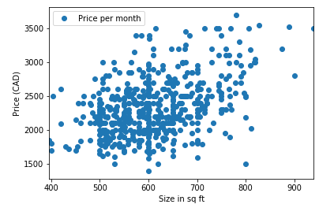
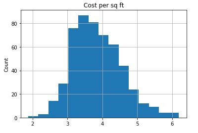
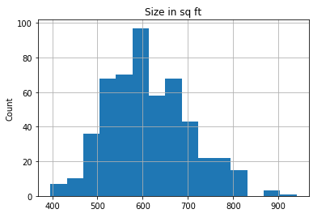
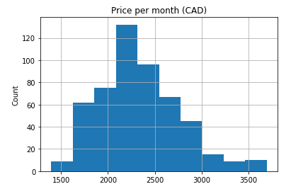

# Craigslist Scrapy for Vancouver

## Install

`pip install scrapy pypiwin32 matplotlib`

## Get data

`scrapy crawl apartments -o results.csv`

## Get graphs

Install [Anaconda](https://docs.anaconda.com/anaconda/install/windows/) and run the Jupyter notebook `Jupyter.ipynb`

  

